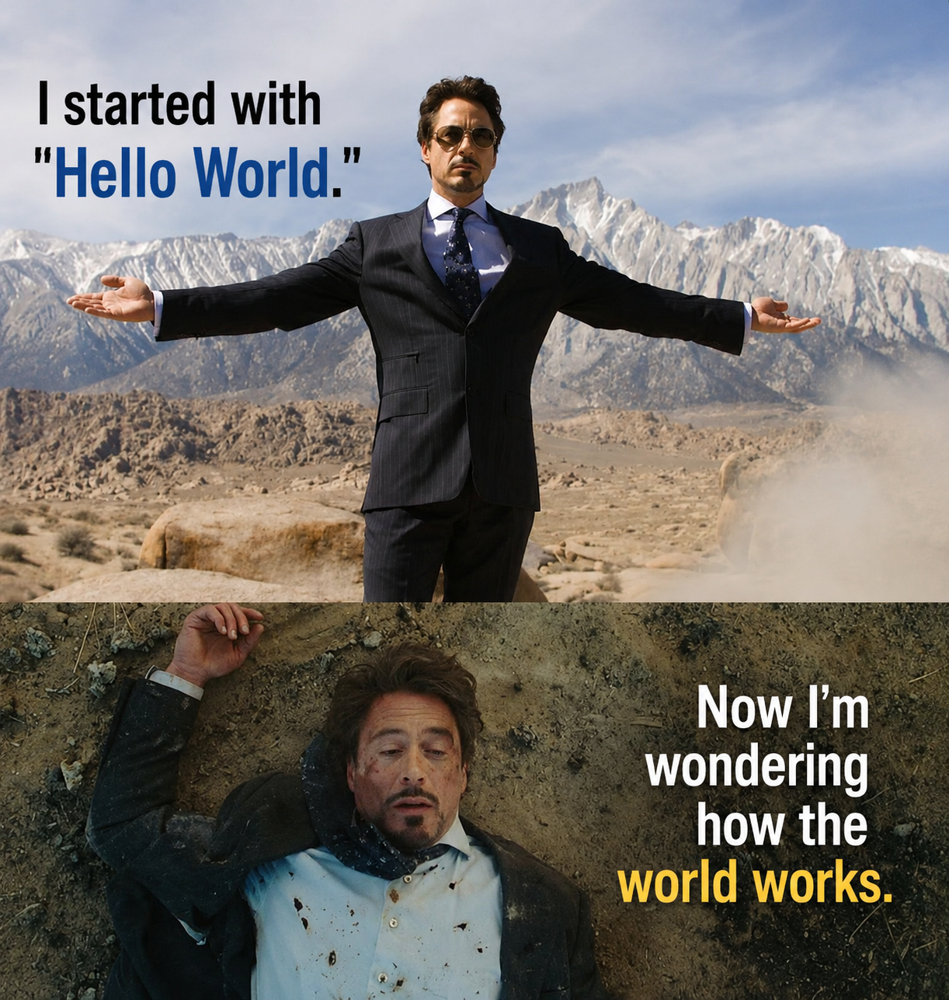

#  Hey, I'm Nigam!

I ❤️ building things that make people go *"wait, you made THAT?"*

Full stack dev by day, ML engineer by night, and someone who apparently can't stop building dev tools with names starting with "Nova".
My to-do list has more items than my GitHub has commits. We don't talk about that.

> *"I started with Hello World. Now I'm wondering how the world works."*

## Recent projects:

- [🏥 HealthHub AI](https://github.com/MiliKava/HealthHubAi) — AI-powered medical triage + telehealth platform built with a team. RAG over 50k+ medical knowledge chunks, encrypted WebRTC video calls, role-based auth, and fully Dockerized. React · FastAPI · pgvector · Docker
- [📡 JobRadar](https://github.com/Nigam-Vaghani/JobRadar) — Discover jobs before everyone else. AI-powered job aggregation, matching, alerts, and application tracking. TypeScript *(private, but trust me it slaps)*
- [🌊 NovaTorrent](https://github.com/Nigam-Vaghani/NovaTorrent) — A BitTorrent-inspired distributed file sharing system. Peer discovery, chunked downloads, fault tolerance, decentralization. Built to actually understand how the internet works. Python
- [🔀 NovaGateway](https://github.com/Nigam-Vaghani/NovaGateway) — Lightweight API gateway with reverse proxy, request analytics, traffic control, caching, and scalable backend routing. Python
- [🧠 EvidenceAI](https://github.com/Nigam-Vaghani/EvidenceAI) — Build trustworthy AI assistants from your company's knowledge base. RAG, semantic search, and citation-backed answers. Because hallucinations are not a feature. Python
- [🖥️ NovaOS](https://github.com/Nigam-Vaghani/NovaOs) — Terminal dev assistant you talk to in plain English. `nova "fix import"`, `nova "analyze project"` — it does it, with AI summaries and undo. ⭐ Python
- [🤖 Intellichain AI](https://github.com/Nigam-Vaghani/Intellichain---AI-enabaled-Supply-chain-optimizer) — AI-powered supply chain optimizer for the Walmart Challenge. Supply chains have never been this dramatically rescued. Python · Jupyter
- [👋 Gesture Presentation](https://github.com/Nigam-Vaghani/gesture-controlled-presentation) — Control slides with hand gestures via OpenCV. Finally, a use for all that waving. Python · OpenCV
- [⚔️ Codeforces CLI](https://github.com/Nigam-Vaghani/codeforces_cli) — CLI tool for competitive programmers. Fetch, submit, suffer — all from the terminal. ⭐ Python
- [🦀 uwu](https://github.com/Nigam-Vaghani/uwu) — Life is all about "uwu". Written in Rust, because of course it is. Rust

## Skills:

Python · TypeScript · JavaScript · Java · React · Next.js · Django · Flask · FastAPI · TensorFlow · OpenCV · PostgreSQL · MongoDB · Docker · Linux · Rust *(learning)*

## Socials:

